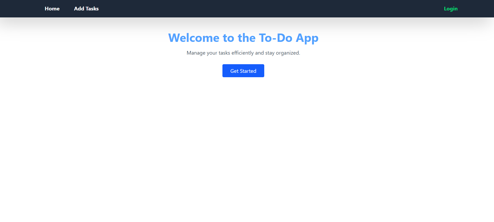
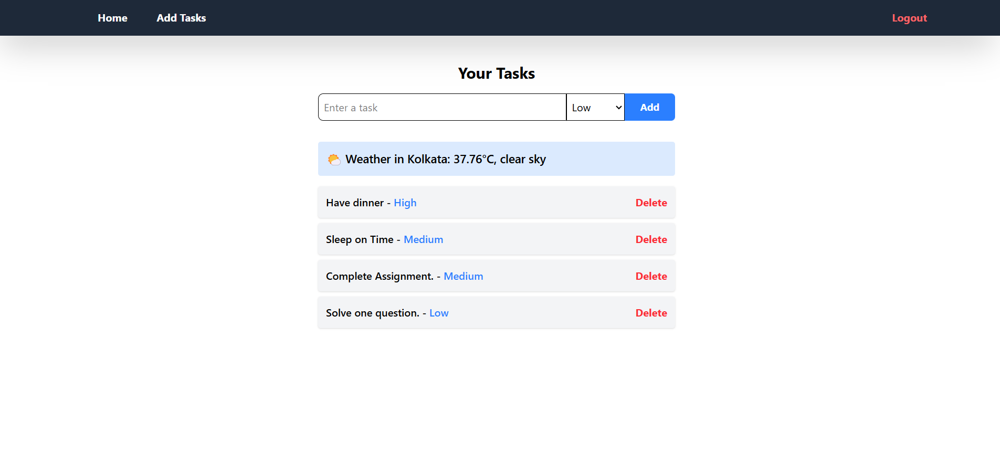
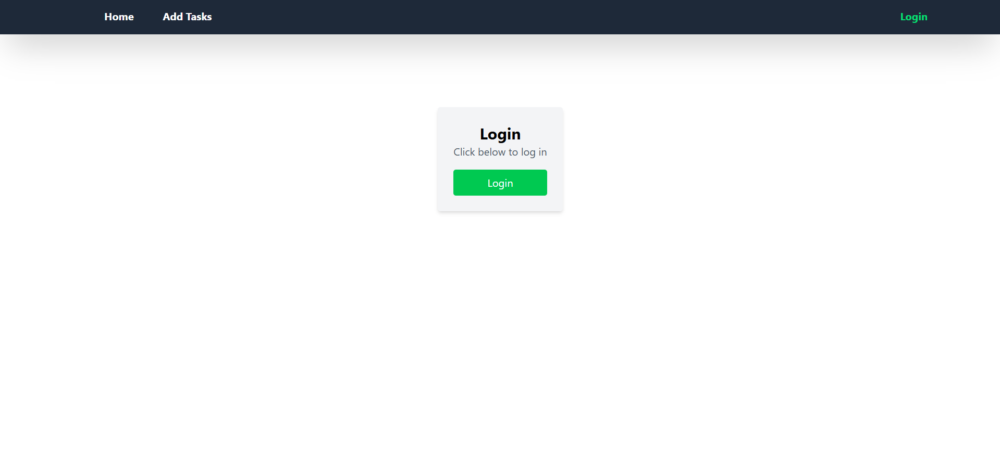

# To-Do List Application

## 🚀 Project Overview

This **To-Do List Application** is built using **React.js**, **Mantine UI**, and **Tailwind CSS**. It allows users to manage tasks efficiently with features like task prioritization, local storage persistence, and authentication. Additionally, the app integrates a weather API to display current weather conditions relevant to tasks.

🔗 **Live Demo:** [View Project]https://to-do-list-app-teal-rho.vercel.app/

## 🛠️ Technologies Used

- **Frontend:** React.js, Mantine UI, Tailwind CSS
- **State Management:** Redux Toolkit & Redux Thunk
- **Storage:** Local Storage for task persistence
- **Authentication:** Mock authentication using Redux
- **API Integration:** Fetches weather data from a public API

## ✨ Features

### 📝 Task Management

- **Add Task:** Users can enter and add tasks to the list.
- **View Tasks:** Displays all tasks in a structured format.
- **Delete Task:** Users can remove tasks with a delete button.
- **Task Prioritization:** Allows setting task priorities (High, Medium, Low).
- **Persistent Storage:** Saves tasks in local storage to retain data across sessions.

### 🔐 User Authentication

- **Login/Logout:** Simulates authentication using Redux (no backend required).
- **Protected Routes:** Tasks are visible only to logged-in users.

### 🌦️ API Integration

- **Weather Display:** Integrates a public weather API to show current weather conditions relevant to tasks.
- **Error Handling:** Gracefully manages API request failures.

## 📂 Project Structure

```
📁 to-do-list-app
│── 📂 src
│   ├── 📂 components
│   │   ├── TaskInput.jsx
│   │   ├── TaskList.jsx
│   │   ├──Navbar.jsx
│   ├── 📂 pages
│   │   ├── Home.jsx
│   │   ├── Login.jsx
│   │   ├── TaskPage.jsx
│   ├── 📂 store
│   │   ├── taskSlice.js
│   │   ├── authSlice.js
│   │   ├── store.js
│   ├── App.jsx
│   ├── main.jsx
│── 📂 public
│── .gitignore
│── package.json
│── README.md
```

## 📌 Installation & Setup

1. Clone the repository:
   ```sh
   git clone https://github.com/PiyushSukhwani/to-do-list-app.git
   cd to-do-list-app
   ```
2. Install dependencies:
   ```sh
   npm install
   ```
3. Start the development server:
   ```sh
   npm run dev
   ```

## 🔧 Usage

1. **Login** to access the to-do list.
2. **Add tasks** using the input field and set priority.
3. **View & delete tasks** as needed.
4. **Check the weather** for outdoor-related tasks.
5. **Logout** to secure your session.

---

## 📸 Screenshots

### 🏠 Home Page


### 📋 Task List


### 🌦️ Login Page


```

✅ **Developed by Piyush using React.js, Mantine, and Tailwind CSS.**
